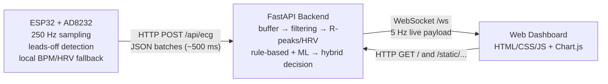

# HeartWatch AI

Streamlined, low‑cost ECG arrhythmia detection system built with ESP32, AD8232, and machine learning. This project provides real‑time monitoring of heart rate, heart rate variability (HRV), and abnormal heartbeat classification (Normal/Abnormal) using a hybrid approach that combines rule‑based detection with a Random Forest classifier trained on the MIT‑BIH Arrhythmia Database.

## 📋 Table of Contents
- [Features](#-features)
- [Project Structure](#-project-structure)
- [Hardware Requirements](#-hardware-requirements)
- [Software Setup](#-software-setup)
- [Hardware Setup](#-hardware-setup)
- [Usage](#-usage)
- [Model Training](#-model-training)
- [Architecture](#-architecture)
- [License](#-license)

## ✨ Features

- **Real‑time ECG Monitoring**: Captures and displays live ECG waveform at 250 Hz
- **Heart Rate Calculation**: Accurate BPM measurement with adaptive thresholding
- **HRV Metrics**: Computes RMSSD, pNN50, and SDNN
- **Arrhythmia Detection**: Hybrid approach combining rule‑based and ML detection (97.97 % accuracy)
- **Web Dashboard**: Beautiful, responsive web interface for real‑time visualization
- **ESP32 Firmware**: Dual‑core FreeRTOS implementation for reliable sampling and transmission
- **Signal Replay**: Replay recorded ECG data for testing and debugging

## 🏗️ Project Structure

```
HeartWatch-AI/
├── backend/              # FastAPI backend server
│   ├── models/        # Trained ML models (rf_model.pkl)
│   ├── app.py        # Main FastAPI application
│   ├── config.py
│   ├── ecg_buffer.py
│   ├── hrv_engine.py
│   ├── hybrid_decision.py
│   ├── ml_predictor.py
│   ├── replay.py
│   ├── requirements.txt
│   ├── rule_based.py
│   ├── signal_processing.py
│   └── simulator.py
├── docs/               # Documentation files
│   ├── Testing_Guide.md
│   ├── architecture.md
│   ├── debugging.md
│   └── wiring_guide.md
├── esp32/              # ESP32 firmware
│   └── ecg_stream/
│       └── ecg_stream.ino
├── frontend/           # Web dashboard
│   ├── app.js
│   ├── index.html
│   └── style.css
├── ml_training/       # ML model training scripts
│   ├── ML_TRAINING_PLAN.md
│   ├── evaluate_model.py
│   ├── requirements.txt
│   └── train_model.py
├── .gitignore
├── LICENSE
├── README.md
├── app.py
└── requirements.txt
```

## 🛠️ Hardware Requirements

- **ESP32 Development Board**
- **AD8232 ECG Sensor Module**
- **ECG Electrodes (3 leads)**
- **Jumper Wires**
- **USB Cable**

## 💻 Software Setup

### 1. Clone the Repository

```bash
git clone https://github.com/yameeshnayak04/HeartWatch-AI.git
cd HeartWatch-AI
```

### 2. Create and Activate Virtual Environment

```bash
python -m venv venv

# On Windows
venv\Scripts\activate

# On macOS/Linux
source venv/bin/activate
```

### 3. Install Dependencies

```bash
pip install -r requirements.txt
```

### 4. Configure ESP32 Firmware

1. Open `esp32/ecg_stream/ecg_stream.ino` in Arduino IDE
2. Update WiFi credentials:
   ```cpp
   const char* ssid = "YOUR_WIFI_SSID";
   const char* password = "YOUR_WIFI_PASSWORD";
   ```
3. Update server URL to your computer's local IP:
   ```cpp
   const char* serverUrl = "http://YOUR_LOCAL_IP:8000/api/ecg";
   ```
4. Upload the firmware to your ESP32

## 🔌 Hardware Setup

Wire the components as follows:

| AD8232 Pin | ESP32 Pin |
|--------------|-----------|
| GND          | GND       |
| 3.3V         | 3V3       |
| OUTPUT       | GPIO34    |
| LO-          | GPIO25    |
| LO+          | GPIO26    |

> **Note**: Connect the ECG electrodes to your body:
- RA (Right Arm)
- LA (Left Arm)
- RL (Right Leg) - Reference

##  Usage

### 1. Start the Backend Server

```bash
cd backend
python app.py
```

The server will start at `http://localhost:8000`

### 2. Open the Dashboard

Navigate to `http://localhost:8000` in your web browser to view the real‑time ECG monitor.

### 3. Power on ESP32

Connect the ESP32 to power and attach the ECG electrodes. The system will start streaming data to the backend.

## 🤖 Model Training

The project uses a Random Forest classifier trained on the MIT‑BIH Arrhythmia Database. To retrain the model:

1. Navigate to the `ml_training/` directory
2. Install training dependencies:
   ```bash
   cd ml_training
   pip install -r requirements.txt
   ```
3. Run the training script (or use Google Colab as described in `ML_TRAINING_PLAN.md`):
   ```bash
   python train_model.py
   ```
4. The trained model will be saved as `rf_model.pkl`
5. Copy the model to `backend/models/`

## 🏛️ Architecture

### System Overview



#### Key Endpoints
- `POST /api/ecg`: ingest ECG batches from ESP32 (or a simulator)
- `GET /`: serve the dashboard UI
- `GET /static/*`: serve frontend assets
- `GET /api/health`: quick health/status check
- `GET /api/replay/files`, `POST /api/replay/start`, `POST /api/replay/stop`: replay a recorded CSV stream (when available)

### Detection Pipeline

1. **Signal Acquisition**: ESP32 samples ECG at 250 Hz using AD8232
2. **Transmission**: Data sent to backend in 500 ms batches
3. **Buffering**: 10‑second ring buffer stores recent samples
4. **Signal Processing**: Filtering, R‑peak detection, feature extraction
5. **Rule‑Based Detection**: Clinical thresholds (60‑100 BPM normal)
6. **ML Prediction**: Random Forest classifier
7. **Hybrid Decision**: Combines both approaches for final verdict
8. **Visualization**: Real‑time updates via WebSocket to dashboard

## 📄 License

This project is licensed under the MIT License. See `LICENSE` file for details.
