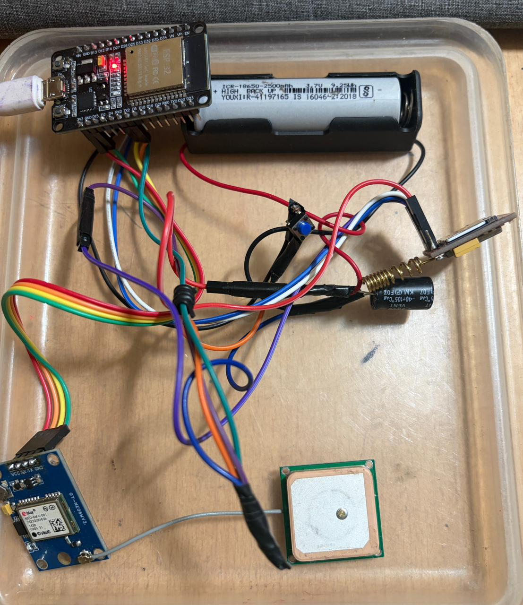
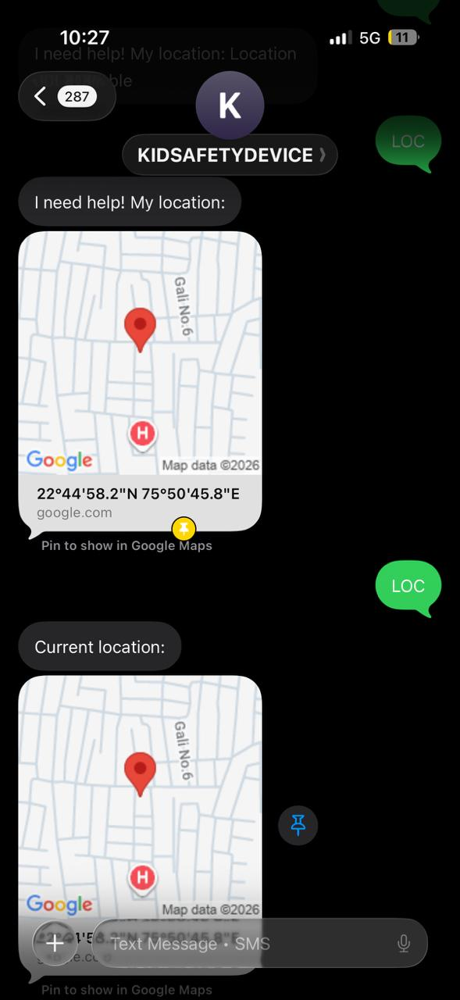
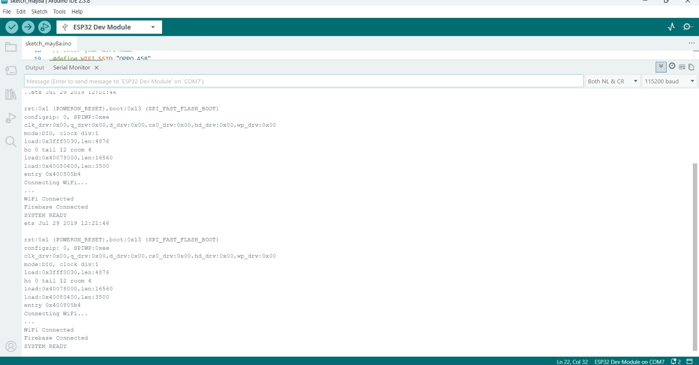
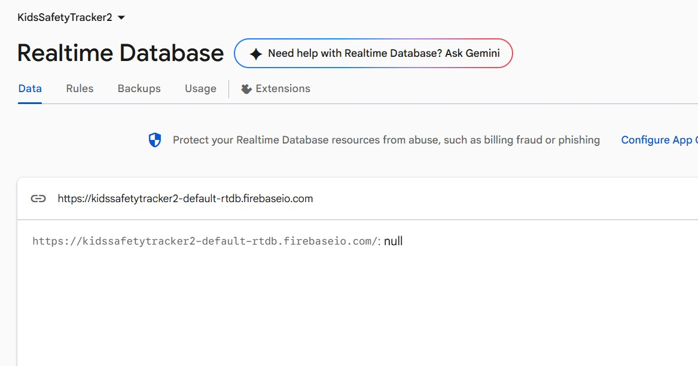

# Kids Safety Tracker using ESP32, GPS, GSM and Firebase

## Project Title

**Kids Safety Tracker using ESP32, GPS, GSM and Firebase**

---

## Project Category

**IoT Based Safety and Emergency Alert System**

---

## Project Overview

Kids Safety Tracker is an IoT-based safety system designed to provide real-time location tracking and emergency alert support for children. The project uses an ESP32 microcontroller as the main controller, GPS module for location tracking, GSM module for SMS and call alerts, SOS push button for emergency triggering, and Firebase Realtime Database for cloud-based location storage.

The system continuously reads location data from the GPS module. The ESP32 processes the latitude and longitude values and generates a Google Maps location link. This location data is uploaded to Firebase using WiFi so that it can be monitored remotely.

In an emergency situation, the child can press the SOS button. After pressing the button, the system sends an emergency SMS containing the Google Maps location link to the registered parent mobile number and also makes an emergency phone call using the GSM module.

This project is useful for child safety, women safety, elderly tracking, school-going children monitoring, and emergency alert systems.

---

## Institute Details

**Shri G. S. Institute of Technology and Science, Indore**  
Department of Information Technology  
B.Tech Information Technology  
6th Semester  
Minor Project 2026

---

## Guide

**Dr. Puja Gupta**  
Assistant Professor  
Department of Information Technology  
SGSITS, Indore

---

## Team Members

| Name | Roll Number | Role |
|---|---|---|
| Satakshi Rathod | 0801IT243D12 | Team Leader |
| Prakriti Baghel | 0801IT243D09 | Team Member |
| Nidhi Bisen | 0801IT243D05 | Team Member |

---

## Technologies Used

| Technology | Purpose |
|---|---|
| ESP32 | Main microcontroller |
| GPS | Location tracking |
| GSM | SMS and call alert |
| Firebase Realtime Database | Cloud location storage |
| WiFi | Internet connectivity |
| Arduino IDE | Code development |
| Embedded C / Arduino Programming | Programming language |

---

## Hardware Components Used

| Component | Description |
|---|---|
| ESP32 Development Board | Main controller of the project |
| GPS Module | Provides latitude and longitude |
| GSM Module | Sends SMS and makes emergency call |
| SOS Push Button | Triggers emergency alert |
| Capacitor | Stabilizes GSM power supply |
| Battery | Provides portable power supply |
| Jumper Wires | Used for circuit connections |

---

## Component Explanation

### ESP32

ESP32 is the main controller of the system. It reads GPS data, checks SOS button status, connects to WiFi, uploads location to Firebase, and sends commands to the GSM module.

### GPS Module

The GPS module receives satellite signals and provides the current latitude and longitude of the device. These coordinates are converted into a Google Maps link.

### GSM Module

The GSM module is used to send emergency SMS and make phone calls. When the SOS button is pressed, ESP32 sends AT commands to the GSM module.

### SOS Button

The SOS button is used to trigger the emergency alert system. When pressed, the system sends the location message and makes a call.

### Capacitor

The capacitor is connected with the GSM power supply to reduce voltage fluctuations. GSM modules require high current during SMS and call operations. The capacitor helps provide stable power and prevents sudden restart of the GSM module.

### Battery

The battery provides power to the GSM module and makes the system portable.

### Firebase Realtime Database

Firebase is used to store live location data such as latitude, longitude, and Google Maps link. It allows remote monitoring of the child’s location.

---

## System Architecture

The system architecture consists of input devices, processing unit, communication modules, and cloud storage.

```text
+------------------+
|   GPS Module     |
| Latitude/Longitude
+---------+--------+
          |
          v
+------------------+          WiFi          +---------------------------+
|      ESP32       |----------------------->| Firebase Realtime Database |
| Main Controller  |                        | Latitude, Longitude, Link |
+---------+--------+                        +---------------------------+
          |
          | AT Commands
          v
+------------------+
|   GSM Module     |
| SMS + Call Alert |
+---------+--------+
          |
          v
+------------------+
| Parent Mobile    |
| SMS + Call       |
+------------------+

SOS Button ---> ESP32 ---> Emergency Alert
```

---

## Data Flow Diagram

```text
GPS Module
   |
   | Sends latitude and longitude
   v
ESP32
   |
   | Creates Google Maps link
   v
WiFi Connection
   |
   | Uploads data
   v
Firebase Realtime Database
   |
   | Stores live location
   v
Parent/Guardian can view location


SOS Button Pressed
   |
   v
ESP32
   |
   | Sends AT commands
   v
GSM Module
   |
   | Sends SMS and makes call
   v
Parent Mobile
```

---

## Working Process

1. ESP32 is powered ON.
2. ESP32 connects to the configured WiFi network.
3. Firebase connection is initialized.
4. GPS module starts receiving satellite data.
5. ESP32 reads latitude and longitude from the GPS module.
6. ESP32 creates a Google Maps link using latitude and longitude.
7. Location data is uploaded to Firebase Realtime Database.
8. When the SOS button is pressed, ESP32 gets the current location.
9. ESP32 sends AT commands to the GSM module.
10. GSM module sends an emergency SMS to the parent number.
11. GSM module also makes an emergency call to the parent.
12. Parent receives location link and can open it in Google Maps.

---

## Circuit Connections

### GPS Module to ESP32

| GPS Pin | ESP32 Pin |
|---|---|
| VCC | 3.3V |
| GND | GND |
| TX | RX2 GPIO16 |
| RX | TX2 GPIO17 |

### GSM Module to ESP32

| GSM Pin | ESP32 Pin |
|---|---|
| VCC | External Battery Positive |
| GND | GND |
| TXD | GPIO26 |
| RXD | GPIO27 |

### SOS Button to ESP32

| Button Pin | ESP32 Pin |
|---|---|
| One side | GPIO14 |
| Other side | GND |

### Capacitor Connection

| Capacitor Pin | Connection |
|---|---|
| Positive / Long Leg | GSM VCC / Battery Positive |
| Negative / Short Leg | GND |

---

## Important Circuit Notes

- GPS module is powered using ESP32 3.3V.
- GSM module should not be powered directly from ESP32.
- GSM module requires external battery or stable 4V power supply.
- Common GND should be connected between ESP32, GPS, GSM, and battery.
- Capacitor is used across GSM VCC and GND to stabilize voltage.
- GPS works best in open sky or outdoor conditions.
- GSM requires proper SIM network and recharge.

---

## Firebase Setup

### Step 1: Create Firebase Project

1. Open Firebase Console.
2. Click on Create Project.
3. Enter project name.
4. Disable Google Analytics if not required.
5. Create the project.

### Step 2: Create Realtime Database

1. Go to Build.
2. Select Realtime Database.
3. Click Create Database.
4. Select region.
5. Start in test mode.
6. Click Enable.

### Step 3: Set Database Rules

Use the following rules for testing:

```json
{
  "rules": {
    ".read": true,
    ".write": true
  }
}
```

### Step 4: Add Firebase URL in Code

```cpp
#define FIREBASE_HOST "kidssafetytracker2-default-rtdb.firebaseio.com"
#define FIREBASE_AUTH ""
```

---

## Arduino IDE Setup

### Required Software

- Arduino IDE
- ESP32 Board Package
- Firebase ESP32 Library
- TinyGPSPlus Library

### Step 1: Add ESP32 Board URL

Open Arduino IDE:

```text
File → Preferences
```

Add this URL in Additional Boards Manager URLs:

```text
https://raw.githubusercontent.com/espressif/arduino-esp32/gh-pages/package_esp32_index.json
```

### Step 2: Install ESP32 Board

```text
Tools → Board → Boards Manager
```

Search:

```text
ESP32
```

Install:

```text
esp32 by Espressif Systems
```

### Step 3: Select Board

```text
Tools → Board → ESP32 Arduino → ESP32 Dev Module
```

### Step 4: Install Libraries

```text
Sketch → Include Library → Manage Libraries
```

Install:

- Firebase ESP32 Client by Mobizt
- TinyGPSPlus by Mikal Hart

### Step 5: Upload Code

Open:

```text
kids_safety_tracker.ino
```

Update WiFi details:

```cpp
#define WIFI_SSID "YOUR_WIFI_NAME"
#define WIFI_PASSWORD "YOUR_WIFI_PASSWORD"
```

Then upload the code to ESP32.

### Step 6: Open Serial Monitor

Set baud rate:

```text
115200
```

Expected output:

```text
Connecting WiFi...
WiFi Connected
Firebase Connected
SYSTEM READY
```

---

## Code File

The Arduino source code is available in:

```text
Code/kids_safety_tracker.ino
```

---

## Firebase Database Structure

After successful upload, Firebase Realtime Database stores data in the following structure:

```text
Location
├── Latitude
├── Longitude
└── GoogleMaps
```

---

## Project Images

### Hardware Setup



### SMS Location Alert



### Serial Monitor Output



### Firebase Realtime Database


---

## Output

When the system starts, the Serial Monitor displays:

```text
Connecting WiFi...
WiFi Connected
Firebase Connected
SYSTEM READY
```

When GPS location is received:

```text
Latitude: xx.xxxxxx
Longitude: xx.xxxxxx
Uploaded to Firebase
```

When SOS button is pressed:

```text
SOS BUTTON PRESSED
Sending SMS...
SMS SENT
Calling Parent...
Call Ended
```

---

## Applications

- Child safety tracking
- Women safety system
- Elderly person tracking
- School bus tracking
- Emergency alert system
- Vehicle tracking
- IoT-based safety monitoring

---

## Advantages

- Real-time location tracking
- Emergency SMS alert
- Emergency call feature
- Firebase cloud storage
- Low-cost implementation
- Portable design
- Easy to use

---

## Limitations

- GPS may not work properly indoors.
- Firebase upload requires WiFi or hotspot.
- GSM SMS and call require SIM network.
- GSM module requires stable external power.
- Battery backup depends on battery capacity.

---

## Future Scope

- Mobile application for parents
- Live map tracking dashboard
- Geo-fencing alerts
- Location history storage
- Battery percentage monitoring
- Compact PCB design
- Panic buzzer alert
- Parent login authentication
- GSM internet/GPRS based Firebase upload

---

## Conclusion

Kids Safety Tracker using ESP32, GPS, GSM and Firebase is a practical IoT-based safety project. It provides real-time location tracking using GPS and Firebase, along with emergency SMS and call alerts using GSM. The system is low-cost, portable, and useful for child safety and emergency monitoring.

This project demonstrates the use of embedded systems, IoT, cloud database, and wireless communication in a real-life safety application.

---

## Folder Structure

```text
Kids-Safety-Tracker/
│
├── README.md
│
├── Code/
│   └── kids_safety_tracker.ino
│
├── Report/
│   └── Kids_Safety_Tracker_Report.pdf
│
├── Images/
│   ├── 01_Hardware_Setup.jpg
│   ├── 02_SMS_Location_Alert.jpg
│   ├── 03_Serial_Monitor_Output.jpg
│   ├── 04_Firebase_Realtime_Database.jpg
│   └── 05_Project_Thumbnail.jpg
│
└── Video/
    └── YouTube_Script.md
```

---

## Important

GitHub public repository me code ke andar real phone number mat daalna. Isko aise rakhna:

```cpp
String parentNumber = "+91XXXXXXXXXX";
```

WiFi password bhi hide karna:

```cpp
#define WIFI_SSID "YOUR_WIFI_NAME"
#define WIFI_PASSWORD "YOUR_WIFI_PASSWORD"
```
